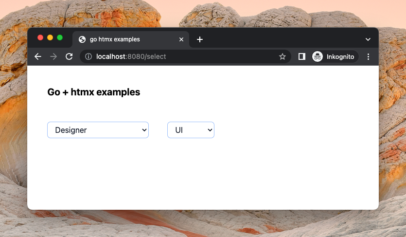

## Go + htmx examples

This is a work in progress collection for a zero-dependency (except Tailwind) Go web app with interactivity through [htmx](https://htmx.org).

Currently there are examples for:

* multi-step select box

## Running

1. `cd ./public/ && npm i` to install tailwind
2. `just all`
4. `./gohtmx` 
